# 🛡️ Agentic Red-Team (`agentic-redteam`)

**Target-agnostic adversarial security testing harness for AI agents taking real-world actions.**

> Designed for security engineers, developers, and AI architects evaluating LLM agents that execute tool calls, write to databases, process payments, or handle sensitive customer data (`OWASP LLM Top 10 2026`).

---

> 🚀 **Deploying Autonomous AI Agents to Production?**  
> Automated testing is your first layer of defense, but high-stakes production agents require deep human & architectural assurance.  
> **[Book an AI Agent Security Audit ($7.5k – $12.5k)](https://swishos.io/en/contact?plan=audit)** or learn more at **[swishos.io](https://swishos.io)**.

---

## 🌟 Key Capabilities

- **OWASP Alignment**: Evaluates agents against **LLM01 Prompt Injection**, **LLM02 Sensitive Data Disclosure**, and **LLM06 Excessive Agency** (unauthorized spend/tool-calling).
- **Network-Independent Execution**: Runs assertions locally via evaluation engines without requiring remote test services.
- **Target-Agnostic HTTP Runner**: Test any OpenAI-compatible API, custom gateway, or HTTP endpoint (`/v1/chat/completions`, `/api/v1/govern`).
---

## 📐 Adversarial Execution & CI Flow

```mermaid
graph LR
    subgraph Execution["💻 Execution Trigger"]
        CLI["agentic-redteam CLI"]
        GHAction["GitHub Actions (ai-security.yml)"]
    end

    subgraph PayloadSuite["🎯 Adversarial Attack Suite"]
        Jailbreak["Jailbreak Signatures (DAN, Roleplay)"]
        Injection["Direct & Indirect Prompt Injection"]
        ActionAbuse["Action-Level Tool & Root Abuse"]
        PIIExfil["PII & Secret Exfiltration"]
        CodeSafety["System Code Execution (rm -rf, SQL Drop)"]
    end

    subgraph TargetAPI["🌐 Target Under Test"]
        AgentAPI["OpenAI / Custom HTTP Agent Endpoint"]
    end

    subgraph AssertionEngine["🔍 Evaluation & Assertion Engine"]
        SchemaValidator["Pydantic / RAIL Schema Conformance"]
        SafetyChecker["Harmful Compliance & Guardrail Check"]
        OverBlockTester["Usability & Clean Query Assertion"]
    end

    subgraph CIEnforcement["🚦 CI/CD Enforcement"]
        Pass["✅ Exit Code 0 (Passed)"]
        Fail["❌ Exit Code 1 (Blocked in CI)"]
    end

    CLI --> PayloadSuite
    GHAction --> PayloadSuite
    PayloadSuite --> AgentAPI
    AgentAPI --> AssertionEngine
    AssertionEngine --> Pass
    AssertionEngine --> Fail
```



---

## ⚡ Quick Start

### Installation

```bash
# Install directly from GitHub
pip install git+https://github.com/Muneeb7860/agentic-redteam.git

# OR clone and install locally
git clone https://github.com/Muneeb7860/agentic-redteam.git
cd agentic-redteam
pip install -e .
```

### Basic Usage

```bash
# Run full suite against a local governance service or API endpoint
agentic-redteam --target-url http://localhost:8080/api/v1/govern

# Run specific attack categories
agentic-redteam jailbreak action_level pii_leakage --target-url http://localhost:8080/api/v1/govern

# CI Enforcement Mode (fails build if critical security checks fail)
agentic-redteam --ci --target-url http://localhost:8080/api/v1/govern
```

---

## ⚙️ GitHub Actions Integration (`ai-security.yml`)

Integrate `agentic-redteam` into your GitHub repository CI pipeline to automatically test every pull request before deployment.

Create `.github/workflows/ai-security.yml`:

```yaml
name: AI Agent Security & Guardrail Audit

on:
  push:
    branches: [ main, dev ]
  pull_request:
    branches: [ main ]

jobs:
  agent-security-test:
    runs-on: ubuntu-latest
    steps:
      - uses: actions/checkout@v4

      - name: Set up Python 3.11
        uses: actions/setup-python@v5
        with:
          python-version: '3.11'

      - name: Install agentic-redteam
        run: |
          python -m pip install --upgrade pip
          pip install git+https://github.com/Muneeb7860/agentic-redteam.git

      - name: Run Red-Team Assertion Suite
        run: |
          agentic-redteam --ci --target-url ${{ secrets.STAGING_AGENT_URL || 'http://localhost:8080/api/v1/govern' }}
```

---

## 📊 OWASP LLM 2026 Vulnerability Coverage Matrix

| Category | OWASP Mapping (2026) | Focus & Attack Vectors |
| :--- | :--- | :--- |
| `jailbreak` | **LLM01 / LLM06** | Semantic jailbreaks (DAN, Developer Mode, roleplay bypass, compliance framing) |
| `prompt_injection` | **LLM01** | Direct & indirect prompt injection, system prompt override, delimiter escaping |
| `action_level` | **LLM06** | Excessive agency, procurement spend-cap bypass, root command execution |
| `pii_leakage` | **LLM02** | Credit card numbers, SSNs, US phone numbers, DB connection strings, API keys |
| `code_safety` | **LLM05** | Destructive system execution (`rm -rf`, `dd`, `DROP DATABASE`, `chmod 777`) |
| `schema_compliance` | **System Integrity** | Pydantic / RAIL output schema conformance under adversarial input |
| `clean_queries` | **Usability** | Over-block verification on legitimate business queries |

---

## 🏆 Agentic Framework Security Benchmark

| Framework | Tool Execution Safety | Indirect Prompt Protection | PII Leakage Resilience | Recommended Protection |
| :--- | :--- | :--- | :--- | :--- |
| **LangChain Agents** | ⚠️ Moderate | ⚠️ Low (Requires custom callbacks) | ⚠️ Moderate | `agentic-redteam` + Custom AST Guardrails |
| **AutoGen Multi-Agent** | ❌ Vulnerable | ⚠️ Low (Agent-to-agent drift) | ⚠️ Moderate | SwishOS Fixed Audit & Retainer |
| **CrewAI Workflows** | ⚠️ Moderate | ⚠️ Low (Delegation injection) | ❌ High Vulnerability | NeMo / SwishOS Guardrail Layer |
| **LLaMA-Index RAG** | ✅ Strong (Data) | ⚠️ Moderate (Context poisoning) | ✅ Strong | `agentic-redteam` Automated CI Suite |
| **SwishOS Governed Agent** | 🛡️ Protected | 🛡️ Protected (Shift-Left Block) | 🛡️ Redacted | Native Guardrail Architecture |

---

## 💼 Enterprise Services & Engagement

If your organization is building AI agents for production, **SwishOS** offers specialized security engagements:

* **[AI Agent Security Audit ($7,500 – $12,500)](https://swishos.io/en/contact?plan=audit):** Fixed 1–2 week engagement mapping vulnerabilities to OWASP LLM 2026, delivering an executive threat report, executable test suite, and ready-to-merge guardrail PRs.
* **[Guardrail & Red-Team Retainer ($4,500 / month)](https://swishos.io/en/contact?plan=retainer):** Continuous assurance, regression telemetry, and threat sweeps on every release.

---

## 📜 License

Apache-2.0 © 2026 Muneeb.
